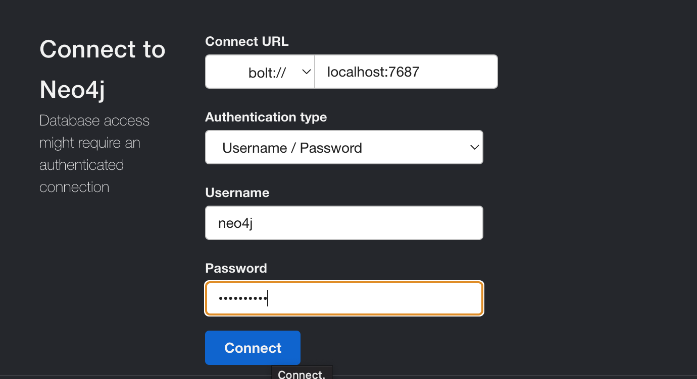
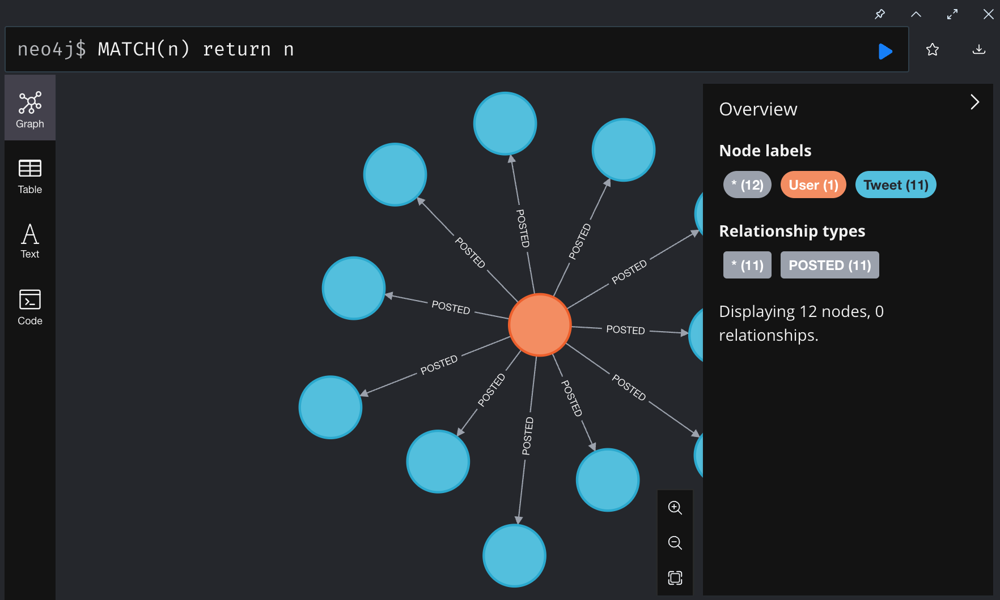

# TweetDownloader
An example of a tweet downloader using Aevatar AI framework.

## Requirements
- Docker
- Docker Compose

## Usage

1. Start neo4j and mongodb

```
docker compose up -d
```

2. Run the Silo

```
dotnet run --project src/TweetDownloader.Silo/TweetDownloader.Silo.csproj
```

3. Run the Client

```
export TWITTER_BEARER_TOKEN=<YOUR_X_API_TOKEN>
export TWITTER_USER_IDS=<YOUR_USER_IDS> # comma separated list of user ids, example: 1371263177288130561
dotnet run --project src/TweetDownloader.Client/TweetDownloader.Client.csproj
```

4. Open Neo4j Browser and check the data

You can login with username `neo4j` and password `neo4jneo4j`. And you should see some nodes containing tweets posted by your interested users.




